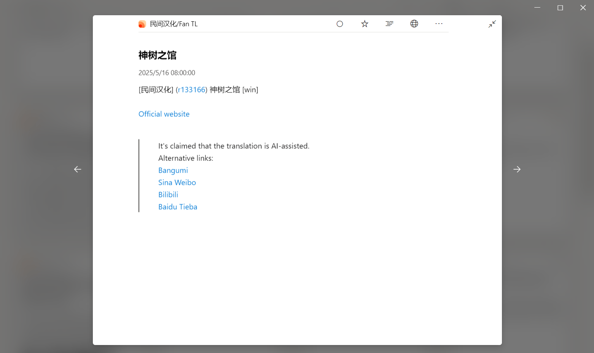

# vndb-rss

## 简介

VNDB RSS 订阅服务，通过调用 [vndb-api](https://api.vndb.org/kana) 获取数据，用来追踪最近发布的视觉小说，并进行格式化显示

## 效果

RSS 阅读器分别是开源的 [fluent-reader](https://github.com/yang991178/fluent-reader/releases/tag/v1.1.4) 和 [Feeder](https://github.com/spacecowboy/Feeder/releases/tag/2.11.5)





## 特性

- 自定义缓存刷新时间

- 自定义图片安全模式 (NSFW/SFW)

- 自定义标签和版本排除

- 自定义平台和媒介筛选

- 非英文版本自动将罗马音标题转换为原名或译名

- bbcode 标记语言自动格式化为 html

- 支持导出 OPML

当前仓库包含多个分支版本，根据语言支持和是否包含封面图进行区分：

- **v1** / **v1-image**：共有 5 个路由：

  - `/offi-ch`、`/offi-en`、`/offi-jp`（官方中文 / 英文 / 日文）

  - `/uo-ch`、`/uo-en`（民间汉化 / Fan Translation）

- **v2** / **v2-image**：基于 v1 分支进行路由合并，仅保留 3 个路由：

  - `/official`：包含官方中文与官方英文

  - `/offi-jp`：官方日文

  - `/unofficial`：包含民间汉化与 Fan Translation

- 含 `-image` 后缀的分支会在 RSS 中附带封面图，普通分支则不会。

✅ 推荐选择：

- 若你**同时使用中文和英文**，推荐部署简洁合并的 **v2 / v2-image** 分支。

- 若你**仅关注某一语言（如中文或英文）**，可选择更细分的 **v1 / v1-image** 分支。

## 部署

部署前需从 [VNDB](https://vndb.org/) 注册账号获取 token (My Profile->Applications->Create new token)

### 部署到服务器

1. 克隆仓库，并切换到你想要运行的分支

   ```bash
    git clone https://github.com/kamomechan/vndb-rss.git
    cd vndb-rss
    git checkout <branch>
   ```

2. 下载 [nodejs](https://nodejs.org/en/download)，版本号应大于等于下列展示的

   ```json
    "engines": {
    "node": ">=22.15.0",
    "npm": ">=10.9.0"
   },
   ```

3. 根据`.env`文件注释进行配置

   ```bash
   vim .env
   ```

4. 运行

   ```bash
   npm install
   npm start
   ```

### 部署到 vercel

1. 点击下面的按钮将其部署到 vercel。

   [](https://vercel.com/import/project?template=https://github.com/kamomechan/vndb-rss)

2. 转到 Environment Variables 选项卡并添加以下变量：

   - `TOKEN` : 你的 VNDB token
   - `SAFETY_MODE`: NSFW 表示不过滤非安全图片，SFW 表示过滤非安全图片。默认值为 SFW，只展示安全的图片(推送条目没有被过滤，只是不展示 NSFW 图片而已) (可选)
   - `DOMAIN` : 你的域名或 vercel 即将分配的域名(不加 http 协议前缀)

   其余配置请见 `.env` 文件，如需设置缓存和条目获取数量，请确保设置符合 [VNDB API 条款](https://api.vndb.org/kana#usage-terms)，建议保持默认即可

   > API access is rate-limited in order to keep server resources in
   > check. The server will allow up to 200 requests per 5 minutes and up to
   > 1 second of execution time per minute. Requests taking longer than 3
   > seconds will be aborted. These limits should be more than enough for
   > most applications, but if this is still too limiting for you, don’t
   > hesitate to get in touch.

3. vercel 默认部署 main 分支，可在 settings->git->Production Branch 中更改生产分支

## 常见问题

**Q: 如果请求数据失败，应该怎么办？**

请参阅 VNDB 官方文档中的 [Tips & Troubleshooting 指南](https://api.vndb.org/kana#tips-troubleshooting)。

---

**Q: 为什么部分视觉小说数据缺失？**

当前筛选规则仅包含 **可下载版（DL 版）**，不包括实体版。
同时，**非官方补丁**仅筛选了**免费补丁**内容，**自定义标签**默认不包含 [**g3723**](https://vndb.org/g3723)，**自定义版本**默认不包含**官方体验版**，因此部分条目会被排除（如果你有其他需求和喜好，可以修改配置文件自部署哦><）

---

**Q: 想自己编写筛选规则，但 Filters 和 Fields 字段文档中只有类型，没有具体取值怎么办？**

你可以通过请求中包含目标字段，并遍历返回结果来收集实际取值。例如使用 `fields` 请求目标字段后打印返回内容，即可了解可用的实际值范围。

---

**Q: 没有多端同步的 RSS 阅读器，如何同步我看过的条目？**

你可以关注已经部署好的 Telegram 频道：[@VisualNovelNews](https://t.me/VisualNovelNews) 它会推送更新内容，适合订阅追踪。

---

注：我只学过 js 的基础内容，这个项目完全是业余时间凭感觉写的，不要对代码质量保持期待 QwQ

最后，如果对你有所帮助，快来一起成为 [VNDB](https://vndb.org/) 编辑者吧~~☆

## License

本项目采用 [AGPL-3.0](./LICENSE) 开源许可证
